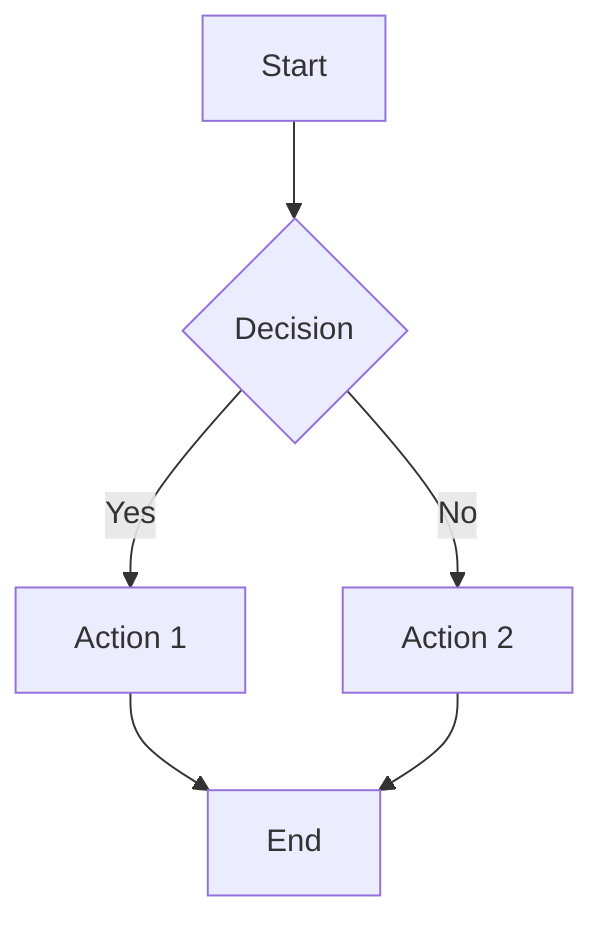

# Business Logic Documentation Template

**Component:** [Component Name]
**Version:** 1.0
**Last Updated:** [Date]
**Owner:** [Team/Person]

## Overview

[Description of the business logic]

## Business Rules

### Rule 1: [Rule Name]

**Condition:**
- [Condition 1]
- [Condition 2]

**Action:**
- [What happens when condition is true]

**Exceptions:**
- [Edge cases and exceptions]

**Related Requirements:**
- REQ-XXX: [Requirement]

### Rule 2: [Rule Name]

[Similar structure]

## Workflows

### Workflow 1: [Process Name]

**Trigger:** [What initiates this workflow]

**Steps:**
1. [Step 1]
2. [Step 2]
3. [Step 3]

**Success Criteria:**
- [Criteria 1]
- [Criteria 2]

**Error Handling:**
- [Error scenario 1 → Recovery]
- [Error scenario 2 → Recovery]

## Implementation Files

- Core Logic: `src/business-logic/[component]/`
- Tests: `tests/business-logic/[component].test.ts`
- Integration Tests: `tests/integration/[component].test.ts`

## Related Entities

- [Entity 1]
- [Entity 2]

## Security Considerations

- [Authentication requirements]
- [Authorization rules]
- [Data protection measures]

## Performance Considerations

- [Performance requirements]
- [Optimization notes]
- [Scalability notes]

## Future Enhancements

- [Potential improvements]
- [Planned features]
