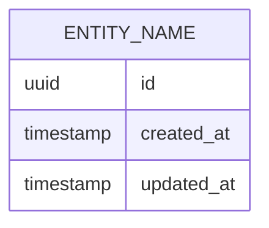

# Data Model Template

**Model Name:** [Entity Name]
**Version:** 1.0
**Last Updated:** [Date]
**Related Schema:** `migrations/XXX_create_entity.sql`

## Overview

[Description of the data model]

## Entity Definition

### Fields

| Field Name | Type | Required | Constraints | Description |
|---|---|---|---|---|
| id | UUID | Yes | Primary Key | Unique identifier |
| created_at | Timestamp | Yes | Default: NOW() | Creation timestamp |
| updated_at | Timestamp | Yes | Default: NOW() | Last update timestamp |
| [field_name] | [type] | [Yes/No] | [Constraints] | [Description] |

### Indexes

- PRIMARY KEY (id)
- INDEX (created_at)
- INDEX ([field_name])

### Constraints

- UNIQUE: [Field list]
- FOREIGN KEY: [Relationships]
- CHECK: [Business rules]

## Relationships

```
[Entity Name]
├── ONE-TO-MANY: Other Entity
├── MANY-TO-ONE: Another Entity
└── MANY-TO-MANY: Third Entity (via junction table)
```

## ER Diagram



## Validation Rules

- Field validations
- Business logic constraints
- Referential integrity rules

## Migration

- **Migration File:** `migrations/XXX_create_entity.sql`
- **Rollback:** Supported
- **Data Loss:** [Yes/No]

## Implementation Files

- Schema Definition: `src/models/entity.ts`
- Database Access: `src/db/repositories/entity-repository.ts`
- Tests: `tests/db/entity.test.ts`

## Related Requirements

- REQ-XXX: [Related requirement]
- REQ-YYY: [Related requirement]
