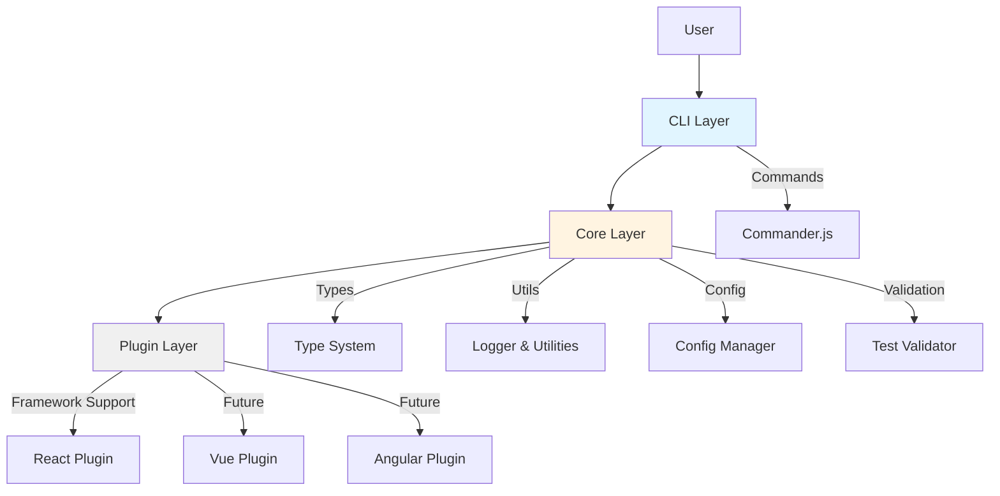
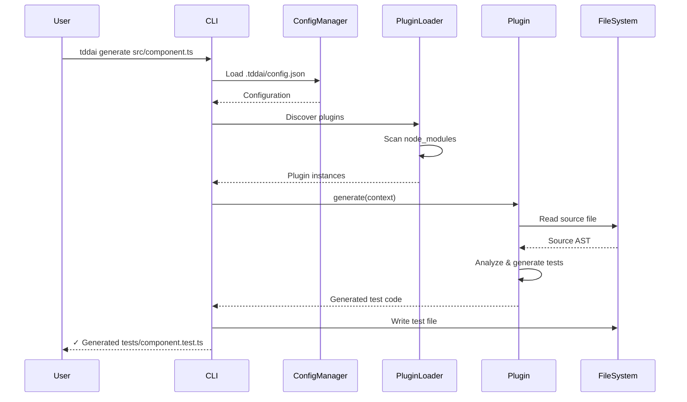
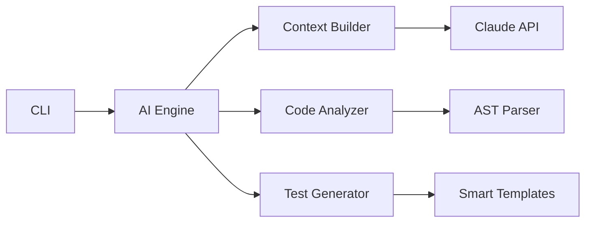

# TDD.ai Architecture

This document describes the high-level architecture, design principles, and technical decisions behind TDD.ai.

## System Overview

TDD.ai is a monorepo-based CLI tool built with TypeScript, designed around a modular, plugin-driven architecture. The system consists of three primary layers:



## Architectural Layers

### 1. CLI Layer (@tddai/cli)

**Responsibility**: User interaction and command orchestration.

**Key Components**:
- Command-line argument parsing (commander.js)
- User feedback and progress display (chalk)
- Command implementations (init, generate, watch, validate, config)
- Error handling and user-friendly messaging

**Dependencies**:
- `@tddai/core` (workspace dependency)
- `commander` (CLI framework)
- `chalk` (terminal styling)

**Design Principles**:
- Single entry point (`bin/tddai`)
- Command pattern for extensibility
- Minimal business logic (delegates to core)
- Clear, actionable error messages

### 2. Core Layer (@tddai/core)

**Responsibility**: Shared types, interfaces, and utilities.

**Key Components**:
- Plugin interface definitions
- Configuration schema (Zod validation)
- Logger and utility functions
- Type definitions for test generation context

**Dependencies**:
- `zod` (schema validation)

**Design Principles**:
- Type-safe contracts between layers
- Framework-agnostic abstractions
- Minimal external dependencies
- Strict TypeScript mode

### 3. Plugin Layer (@tddai/plugin-*)

**Responsibility**: Framework-specific test generation logic.

**Key Components**:
- Framework adapters (React, Vue, Angular, etc.)
- Test template generators
- AST parsing and manipulation
- Framework-specific best practices

**Dependencies**:
- `@tddai/core` (plugin interface)
- Framework-specific peer dependencies

**Design Principles**:
- Plugin discovery via naming convention
- Independent versioning
- Framework idiomatic patterns
- Composable plugin chains

## Module Dependency Graph

```mermaid
graph LR
    CLI[@tddai/cli] --> Core[@tddai/core]
    React[@tddai/plugin-react] --> Core
    Vue[@tddai/plugin-vue] -.future.-> Core
    Angular[@tddai/plugin-angular] -.future.-> Core

    Core --> Zod[zod]
    CLI --> Commander[commander]
    CLI --> Chalk[chalk]

    User((User)) --> CLI

    style Core fill:#ffd700
    style CLI fill:#87ceeb
    style React fill:#61dafb
    style Vue fill:#42b883
    style Angular fill:#dd0031
```

### Internal Dependencies

- All plugins depend on `@tddai/core` for type definitions
- CLI depends on `@tddai/core` for shared logic
- Plugins are peer dependencies (not hard dependencies)

### External Dependencies

**Production**:
- `zod`: Runtime schema validation (core)
- `commander`: CLI framework (cli)
- `chalk`: Terminal styling (cli)

**Development**:
- `typescript`: Type checking and compilation
- `vitest`: Testing framework
- `eslint`: Linting
- `prettier`: Code formatting

## Command Execution Flow



### Detailed Flow

1. **Command Parsing**
   - User invokes `tddai <command> [args]`
   - Commander.js parses arguments and options
   - Validates command syntax

2. **Configuration Loading**
   - Read `.tddai/config.json` from project root
   - Validate schema with Zod
   - Merge with defaults

3. **Plugin Discovery**
   - Scan `node_modules` for `@tddai/plugin-*` packages
   - Load plugins specified in config
   - Validate plugin interface compliance

4. **Plugin Execution**
   - Create execution context (file path, config, framework)
   - Invoke plugin's `generate()` method
   - Plugin analyzes source and generates tests

5. **Output & Feedback**
   - Write generated tests to configured directory
   - Display progress and results to user
   - Handle errors gracefully

## Plugin System

### Plugin Interface

```typescript
export interface Plugin {
  name: string;
  version: string;
  frameworks: string[];

  generate(context: PluginContext): Promise<GeneratedTest>;
  validate?(test: string, source: string): Promise<ValidationResult>;
}

export interface PluginContext {
  sourceFile: string;
  sourceCode: string;
  config: TDDAIConfig;
  framework: string;
  logger: Logger;
}
```

### Plugin Lifecycle

1. **Discovery**: Plugins found via naming convention (`@tddai/plugin-*`)
2. **Registration**: Plugins register supported frameworks
3. **Selection**: Appropriate plugin selected based on config
4. **Execution**: Plugin invoked with context
5. **Validation**: Optional validation of generated tests

### Plugin Discovery Mechanism

```typescript
// Pseudo-code
async function discoverPlugins(): Promise<Plugin[]> {
  const pluginPackages = await glob('node_modules/@tddai/plugin-*');

  return pluginPackages.map(pkg => {
    const module = await import(pkg);
    return module.default as Plugin;
  });
}
```

## Configuration Management

### Configuration Schema

```typescript
export const ConfigSchema = z.object({
  framework: z.enum(['vitest', 'jest', 'mocha', 'jasmine']),
  testDir: z.string().default('tests'),
  testPattern: z.string().default('**/*.test.ts'),
  plugins: z.array(z.string()).default([]),
  generation: z.object({
    coverageTarget: z.number().min(0).max(100).default(85),
    includeEdgeCases: z.boolean().default(true),
    mockExternal: z.boolean().default(true),
  }),
});
```

### Configuration Precedence

1. CLI arguments (highest priority)
2. `.tddai/config.json` (project level)
3. Default values (lowest priority)

### Example Configuration

```json
{
  "framework": "vitest",
  "testDir": "tests",
  "testPattern": "**/*.test.ts",
  "plugins": ["@tddai/plugin-react"],
  "generation": {
    "coverageTarget": 90,
    "includeEdgeCases": true,
    "mockExternal": true
  }
}
```

## Test Strategy

### Testing Pyramid

```
        /\
       /  \     E2E Tests (5%)
      /____\    - Full workflow testing
     /      \
    /        \  Integration Tests (25%)
   /__________\ - Multi-package interaction
  /            \
 /              \ Unit Tests (70%)
/________________\ - Individual functions/modules
```

### Test Coverage Targets

- **Overall**: > 85%
- **Core Package**: > 90% (critical types and utilities)
- **CLI Package**: > 85% (command logic)
- **Plugin Packages**: > 80% (generation logic)

### Test Types

**Unit Tests** (Vitest):
- Pure function testing
- Type validation
- Utility function behavior

**Integration Tests** (Vitest):
- CLI command execution
- Plugin loading and execution
- Configuration management

**E2E Tests** (Future):
- Full workflow: init → generate → validate
- Real-world project scenarios
- Multiple framework combinations

### Test File Organization

```
packages/
├── core/
│   ├── src/
│   │   └── utils/logger.ts
│   └── tests/
│       └── utils/logger.test.ts
├── cli/
│   ├── src/
│   │   └── commands/generate.ts
│   └── tests/
│       └── commands/generate.test.ts
```

## Error Handling Strategy

### Error Categories

1. **User Errors**: Invalid input, missing config
   - Action: Display helpful message with suggestions
   - Exit code: 1

2. **System Errors**: File I/O failures, permissions
   - Action: Log error, suggest fixes
   - Exit code: 2

3. **Plugin Errors**: Plugin crashes, invalid output
   - Action: Isolate failure, continue with other files
   - Exit code: 3

4. **Fatal Errors**: Unrecoverable system failures
   - Action: Log full stack trace, exit gracefully
   - Exit code: 99

### Error Message Format

```typescript
// User-friendly format
Error: Cannot find config file
  → Run 'tddai init' to create .tddai/config.json
  → Or specify config location: --config path/to/config.json

// Developer format (debug mode)
Error: ENOENT: no such file or directory
  at Object.openSync (node:fs:590:3)
  at Object.readFileSync (node:fs:458:35)
  at ConfigManager.load (config.ts:42:19)
```

## Performance Considerations

### Optimization Strategies

1. **Lazy Plugin Loading**: Load plugins only when needed
2. **Parallel Processing**: Process multiple files concurrently
3. **Incremental Builds**: Track file changes, regenerate only modified
4. **Caching**: Cache AST analysis results
5. **Streaming**: Stream large file processing

### Performance Targets

- **Initialization**: < 100ms
- **Single File Generation**: < 500ms
- **Watch Mode Latency**: < 300ms after change detected
- **Large Project (100 files)**: < 10s for full generation

## Security Considerations

1. **No Arbitrary Code Execution**: Plugins sandboxed
2. **Config Validation**: Zod schema prevents injection
3. **File System Access**: Restricted to project directory
4. **Dependency Scanning**: Regular audits with `npm audit`

## Extensibility Points

### 1. Custom Plugins

Developers can create plugins for:
- New test frameworks (e.g., AVA, Tape)
- Framework-specific patterns (e.g., Next.js, Nuxt)
- Custom assertion libraries
- Organization-specific conventions

### 2. Custom Templates

Override default test templates:

```json
{
  "generation": {
    "templatePath": "./custom-templates/"
  }
}
```

### 3. Hooks (Future)

Lifecycle hooks for custom behavior:

```typescript
export interface PluginHooks {
  beforeGenerate?(context: PluginContext): void;
  afterGenerate?(result: GeneratedTest): void;
  onError?(error: Error): void;
}
```

## Design Principles

### 1. Convention over Configuration

- Zero-config for 80% of use cases
- Sensible defaults based on common patterns
- Explicit configuration available when needed

### 2. Progressive Enhancement

- Core features work without plugins
- Plugins add framework-specific enhancements
- Graceful degradation if plugin unavailable

### 3. Developer Experience First

- Clear, actionable error messages
- Fast feedback loops (watch mode)
- Minimal setup friction

### 4. Type Safety

- Strict TypeScript mode throughout
- Runtime validation with Zod
- Compile-time guarantees

### 5. Testability

- Pure functions where possible
- Dependency injection for testing
- Comprehensive test coverage

## Future Architecture Enhancements

### Phase 2: AI Integration



**Additions**:
- AI engine for intelligent test generation
- Context builder for semantic code understanding
- Smart templates with AI-assisted edge case detection

### Phase 3: Advanced Features

- Visual test reporting dashboard
- CI/CD integration plugins
- Test impact analysis
- Mutation testing support
- Multi-language support (Go, Python, Rust)

## References

- [ADR-001: pnpm Workspaces](ADRs.md#adr-001-pnpm-workspaces)
- [ADR-002: Plugin System Architecture](ADRs.md#adr-002-plugin-system)
- [ADR-003: CLI Framework Selection](ADRs.md#adr-003-cli-framework)
- [ADR-004: Test Strategy](ADRs.md#adr-004-test-strategy)

---

**Document Version**: 1.0.0
**Last Updated**: 2025-11-03
**Authors**: Skye (Implementation Lead), Eden (Documentation Lead)
**Review Schedule**: After each major architectural change
